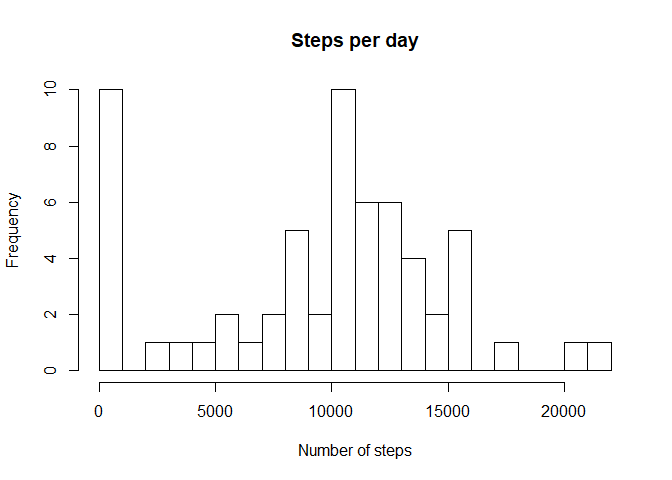
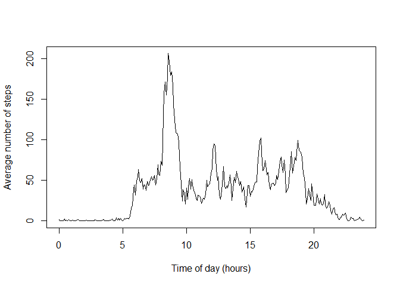
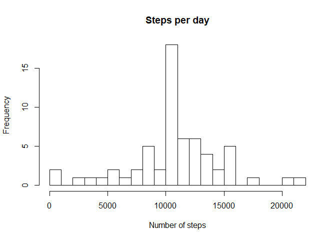
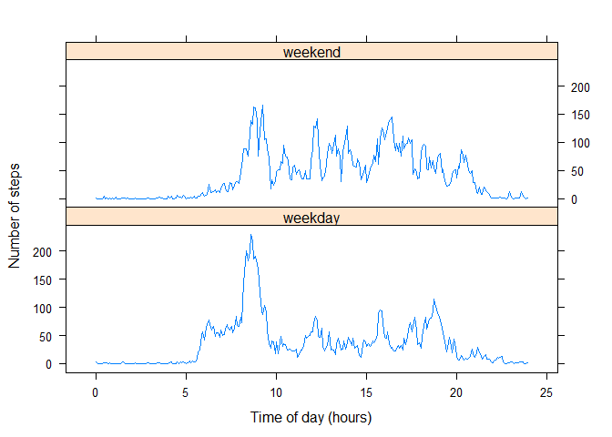

```r
require("tidyverse")
```

```
## Loading required package: tidyverse
```

```
## Registered S3 methods overwritten by 'ggplot2':
##   method         from 
##   [.quosures     rlang
##   c.quosures     rlang
##   print.quosures rlang
```

```
## -- Attaching packages ----------------------------------------------------------------------------------------------------- tidyverse 1.2.1 --
```

```
## v ggplot2 3.1.1     v purrr   0.3.2
## v tibble  2.1.1     v dplyr   0.8.1
## v tidyr   0.8.3     v stringr 1.4.0
## v readr   1.3.1     v forcats 0.4.0
```

```
## -- Conflicts -------------------------------------------------------------------------------------------------------- tidyverse_conflicts() --
## x dplyr::filter() masks stats::filter()
## x dplyr::lag()    masks stats::lag()
```

```r
require("hms")
```

```
## Loading required package: hms
```

```r
require("lattice")
```

```
## Loading required package: lattice
```


## Loading and preprocessing the data

The data is read from the manually unzipped csv file. Dates are converted to date objects and timestamps are converted to a consistent HH:MM format and minutes format.

```r
raw_data <- read.csv("activity/activity.csv", header = T, na.strings = "NA")

data <- raw_data %>% 
    mutate(date = as.Date(date)) %>% 
    mutate(interval = str_pad(interval,4,pad="0")) %>% 
    mutate(time = paste0(str_sub(interval,1,2),':',str_sub(interval,3,4))) %>% 
    mutate(minutes = as.numeric(str_sub(interval,1,2))*60+ as.numeric(str_sub(interval,3,4)))
```


## What is mean total number of steps taken per day?


```r
steps_per_day <- data %>% 
    group_by(date) %>% 
    summarise(steps_total = sum(steps, na.rm = T))

mean_steps_per_day <- mean(steps_per_day$steps_total)
median_steps_per_day <- median(steps_per_day$steps_total)
```

Over a total of 61 days, the average number of steps was 9354.2295082 and the median of steps per day was 10395. 

A Histogram of the steps per day looks as follows:


```r
hist(steps_per_day$steps_total,breaks = 20, xlab="Number of steps",main = "Steps per day")
```

<!-- -->

A large number of days with zero steps can be obeserved. This is due to the fact, that days for which the data is missing are interpreted as "0 steps" here. This is not a usefull assumption, distorts the mean and median values and is corrected in the section below, where missing values are imputed to a valid and usefull assumption.

## What is the average daily activity pattern?

Across all  days in the dataset, the steps per 5-min-interval
are averaged an shown in the plot below.


```r
mean_steps_per_5min <- data %>% 
    group_by(minutes) %>% 
    summarise(steps = mean(steps, na.rm=T)) 

plot(mean_steps_per_5min$minutes/60, mean_steps_per_5min$steps,
     type='l',
     xlab='Time of day (hours)',
     ylab='Average number of steps')
```

<!-- -->

The 5-min-interval at 08:35:00 in the morning has the highest step count throughout the day (a total of 206.1698113). 


## Imputing missing values

### Missing values

For each day 288 5-min intervals should be recorded. The data set
contains missing values for  some days:


```r
data %>% 
  filter(is.na(steps)) %>%
  group_by(date) %>% 
  summarise(missing_5min_intervals = n())
```

```
## # A tibble: 8 x 2
##   date       missing_5min_intervals
##   <date>                      <int>
## 1 2012-10-01                    288
## 2 2012-10-08                    288
## 3 2012-11-01                    288
## 4 2012-11-04                    288
## 5 2012-11-09                    288
## 6 2012-11-10                    288
## 7 2012-11-14                    288
## 8 2012-11-30                    288
```
The table demonstrates that for 8 days no data at all is available while all other days are complete.

### Imputing strategy

Following the above result, the imputing is peformed by assinging the above calculated average daily activity pattern to the days without any data.


```r
missing_data <- data %>% filter(is.na(steps)) %>% select(-steps)

imputed_data <- missing_data %>% left_join(mean_steps_per_5min, by = c("minutes" = "minutes"))


complete_data <- data %>% filter(!is.na(steps)) %>% bind_rows(imputed_data)
```

### Impact of imputing?


```r
steps_per_day_ai <- complete_data %>% 
    group_by(date) %>% 
    summarise(steps_total = sum(steps))

mean_steps_per_day_ai <- mean(steps_per_day_ai$steps_total)
median_steps_per_day_ai <- median(steps_per_day_ai$steps_total)
```

Over a total of 61 days, the average number of steps was 10766.19 and the median of steps per day was 10766.19. The valus are different from the above values and represent a more consistent picture. In the analysis above days with missing values were interpreted as "0 steps", which does not seem to be a usefull assumption. Now, for days without data the average number of steps is used, which is, of course, not correct, but a usefull assumption.

Imputing can have different effects on the estimates of total steps per day. Compared to the analysis above, the estimate changed is now a valid value. In the analysis above, one could have completely remove the days without any data. In that case, the estimate of total steps per day would not change, when imputing missing days with the mean of the other days.

A Histogram of the steps per day looks now as follows:


```r
hist(steps_per_day_ai$steps_total,breaks = 20, xlab="Number of steps",main = "Steps per day")
```

<!-- -->


## Are there differences in activity patterns between weekdays and weekends?


```r
weekday_data <- complete_data %>% mutate(weekday = as.factor(if_else(weekdays(date) %in% c("Samstag","Sonntag"),"weekend","weekday")))
```


```r
weekday_steps_per_5min <- weekday_data %>% 
    group_by(minutes, weekday) %>% 
    summarise(steps = mean(steps, na.rm=T)) 

#par(mfrow = c(1,2))
xyplot(weekday_steps_per_5min$steps~weekday_steps_per_5min$minutes/60|weekday_steps_per_5min$weekday,
     type='l',
     xlab='Time of day (hours)',
     ylab='Number of steps',
     layout=c(1,2))
```

<!-- -->

On weekdays more steps are taken around 08:00 in the morning and less during the trest of the day, compared to weekends.
